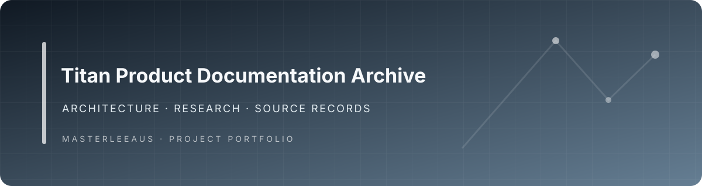

# Titan Product Documentation Archive

**Product research, architecture notes, and WorkCore/Titan Zero design records.**

## Contents

This repository preserves two types of material:

- `workcore/` — curated product documentation, design research, and a full corpus index.
- `TitanDocs 2.zip` — an archive whose full contents and provenance should be checked before reuse.

Start with [WorkCore documentation](workcore/README.md) and its [document corpus index](workcore/DOCUMENT-INDEX.md). The index is the best entry point for finding individual concepts and their recorded status.

## How to use this repository

Treat documents as design evidence, not as proof that a feature is implemented or released. Check the linked source repositories and current product architecture before turning a proposal into implementation work. Preserve source attribution and applicable licenses when using imported material.

## Repository status

**Documentation and source archive.** No application build or runtime is expected from this repository. The ZIP archive is retained as source material; it has not been unpacked or independently audited in this review.

## Banner

A checked-in project-specific banner is displayed above.

