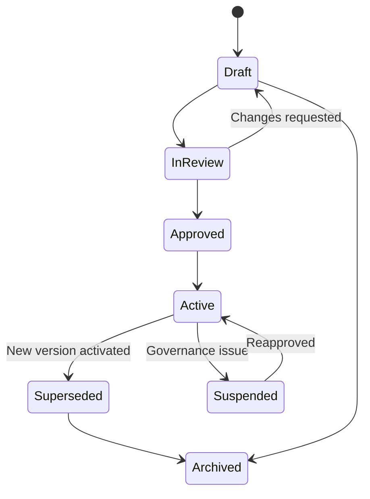
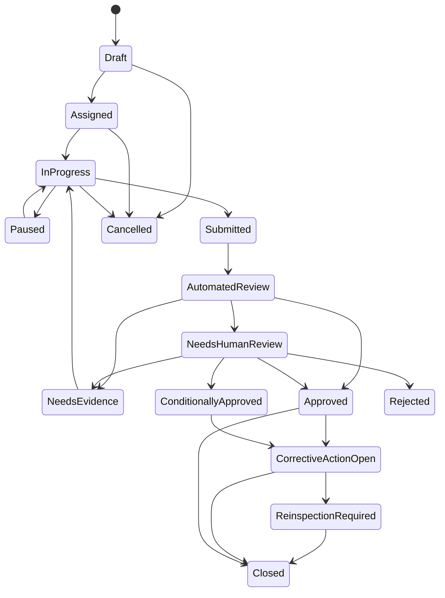

# Titan Inspect

### Deep product design

**Complete inspections, surveys, defects, evidence and certification for field and home service businesses.**

Titan Inspect turns the reusable vision, survey, document, media and multi-model engines discovered in `Extensions.zip` into a complete standalone business application. It is not merely a form builder, photo annotation feature or AI defect detector.

Its end-to-end outcome is:

> Define what must be inspected, guide reliable evidence capture, identify and review findings, convert the result into operational work, and preserve a defensible record of what was observed and decided.

Titan Inspect can operate as a standalone application, but its strongest form is a WorkCore-native extension. WorkCore remains the authority for customers, properties, jobs, staff, quotes, tasks and invoices. Titan Inspect becomes the authority for inspection templates, evidence, findings, review decisions, corrective actions, reports and certificates.

---

## 1. Product thesis

Most inspection products stop at one of four weak endpoints:

1. a completed checklist;
2. a collection of photographs;
3. a generated PDF;
4. an unreviewed AI opinion.

None of those outcomes is sufficient for serious field operations.

A business needs to know:

- whether the correct evidence was captured;
- whether the evidence is usable and complete;
- what was actually found;
- what remains uncertain;
- who reviewed and accepted the result;
- what operational action follows;
- whether corrective work was completed;
- whether the final report can be trusted later.

Titan Inspect therefore treats an inspection as a controlled evidence and decision workflow, not a digital form.

### Product promise

**Capture it correctly. Review it proportionately. Turn it into action. Prove what happened.**

### Primary commercial outcomes

- fewer unnecessary site visits before quoting;
- faster and more consistent inspections;
- reduced missed scope and unpriced work;
- fewer incomplete photo sets;
- earlier identification of defects and hazards;
- clearer customer approvals;
- lower dispute and rework exposure;
- faster conversion from finding to quote, task or corrective action;
- stronger compliance and commercial contract reporting;
- reusable operational knowledge across workers and branches.

---

## 2. Application boundary

### Titan Inspect owns

- inspection-template definitions;
- immutable template versions;
- inspection assignments;
- inspection execution state;
- responses and measurements;
- original evidence and evidence derivatives;
- coordinate annotations;
- machine-generated finding candidates;
- confirmed findings;
- reviewer decisions;
- corrective actions that originate from an inspection;
- reinspection relationships;
- approvals and signatures;
- inspection reports;
- certificates;
- secure external report access;
- inspection-specific audit history;
- AI evaluation provenance.

### WorkCore owns

- businesses and tenants;
- users, teams and employment records;
- customers and contacts;
- properties and service locations;
- jobs and appointments;
- tasks and general project work;
- service catalogue authority when Titan Pricebook is not installed;
- quotes and estimates;
- invoices and payments;
- general customer communication history;
- business-wide permissions and subscription state.

### Other optional app authorities

| Domain | Authority when installed | Titan Inspect relationship |
|---|---|---|
| Assets | Titan Assets | Inspect references assets and creates condition/service events |
| Property structure | Titan Property Twin | Inspect references rooms, zones, surfaces and access information |
| Pricing | Titan Pricebook | Findings resolve to approved services, rules and costs |
| Quotes | Titan Quotes | Findings and scope items become quote lines or variations |
| Scheduling | Titan Schedule | Assigns inspections and corrective/reinspection visits |
| Quality | Titan Quality | Receives QA findings, nonconformances and rework evidence |
| Safety | Titan Safety | Receives hazards, incidents and corrective safety actions |
| Customer communication | Titan Customer Hub | Delivers invitations, reminders, questions and report links |
| Handover | Titan Handover | Receives approved completion evidence and certificates |

Titan Inspect must integrate through IDs, snapshots, commands and events. It must not copy entire customer, job or property systems into its own domain.

---

## 3. Target users and jobs to be done

### Owner or operations manager

- standardise inspections across workers and branches;
- see which inspections are incomplete, risky or overdue;
- turn findings into revenue or corrective work;
- measure inspection quality and commercial impact.

### Inspection designer

- create reusable templates without coding;
- specify evidence, measurements, scoring and decision rules;
- publish controlled versions;
- test a template before field release.

### Field inspector or technician

- know exactly what to inspect next;
- capture evidence quickly with large mobile controls;
- work without reliable connectivity;
- avoid returning to site because evidence was missing;
- submit observations without writing long reports manually.

### Supervisor or reviewer

- focus on uncertain, severe or contradictory findings;
- compare evidence, worker responses and AI assessments;
- confirm, dismiss, modify or escalate findings;
- approve reports and certificates.

### Customer or property representative

- complete a guided pre-quote or condition survey;
- provide photographs without creating an account;
- understand what was found;
- approve scope, access or corrective action;
- receive a clear final report.

### Compliance or contract auditor

- verify the applicable template version;
- inspect chain of evidence and decision history;
- confirm reviewer authority;
- export reports and structured findings;
- identify systemic failures across sites or branches.

### API or system integration

- create assignments;
- receive completed findings;
- create jobs, tasks, quotes or incidents;
- synchronize status without bypassing permissions or audit controls.

---

## 4. Inspection modes

Titan Inspect should use one shared engine while supporting distinct operating modes.

### 4.1 Pre-quote customer survey

A customer receives a secure link and captures the information required to estimate or decide whether a site visit is necessary.

Examples:

- number and condition of rooms;
- access and parking;
- surface types;
- contamination level;
- appliance or equipment data plates;
- garden or exterior dimensions;
- visible damage;
- service urgency.

The result can create a quote-ready scope, a request for more evidence or a technician inspection.

### 4.2 Technician site survey

A worker completes a structured survey before quoting, planning or starting work. The inspection can create measurements, scope lines, hazards and required materials.

### 4.3 Pre-start condition inspection

The app records existing damage, access conditions, hazards and customer instructions before work begins.

### 4.4 In-progress checkpoint

The template requires evidence at specific work stages. A later stage cannot be completed until mandatory checkpoints are satisfied or an authorised exception is recorded.

### 4.5 Completion and proof-of-service inspection

The app verifies that required zones and tasks have completion evidence. This mode can hand findings and evidence to Titan Quality and Titan Handover.

### 4.6 Routine compliance inspection

Recurring site, property, hygiene, equipment or service-standard inspections use controlled templates, reviewer authority and certificate rules.

### 4.7 Asset condition inspection

The inspection records asset identity, condition, faults, measurements and maintenance recommendations. Titan Assets receives the approved result.

### 4.8 Incident or damage inspection

The app captures evidence, chronology, parties, damage, hazards, immediate actions and follow-up requirements. Titan Claims or Titan Safety can take authority after submission.

### 4.9 Reinspection

A reinspection inherits unresolved findings and evidence requirements but remains a new immutable inspection linked to the original.

---

## 5. Core domain model

### 5.1 Template domain

#### InspectionTemplate

The stable business identity of a template, such as `Residential Deep Clean Pre-Quote Survey`.

Key fields:

- tenant and business ID;
- title and code;
- inspection mode;
- vertical and service categories;
- subject types: property, job, asset, customer or incident;
- owner team;
- status;
- active version ID;
- default reviewer policy;
- retention policy;
- report-template references.

#### InspectionTemplateVersion

An immutable published definition.

Key fields:

- semantic version;
- draft source version;
- effective date;
- superseded date;
- author and approver;
- change summary;
- template JSON schema;
- scoring rules;
- AI schemas and prompt versions;
- report-layout version;
- compatibility metadata.

Existing assigned inspections remain tied to the version originally issued unless an authorised migration is explicitly performed.

#### TemplateSection

Groups related inspection work, such as `Kitchen`, `Roof Access` or `Electrical Safety`.

#### TemplateItem

Represents one instruction, response or capture requirement.

Supported item types:

- instruction;
- yes/no;
- pass/fail/not applicable;
- single choice;
- multiple choice;
- short or long text;
- numeric value;
- measurement with unit;
- date and time;
- photo;
- video;
- audio or voice note;
- signature;
- barcode or QR scan;
- asset/data-plate scan;
- geolocation with explicit permission;
- annotated image;
- repeatable room, zone, asset or defect group;
- calculated field;
- reviewer-only field;
- approval gate.

#### EvidenceRequirement

Defines what evidence must accompany an item or finding.

Examples:

- one wide room view and two close-ups;
- photograph must include the asset data plate;
- video must be at least ten seconds;
- measurement must include unit and instrument type;
- signature required from a site representative;
- before and after evidence must use the same zone reference;
- location may be required only for commercial sites where the business has a lawful and disclosed reason.

#### DecisionRule

A deterministic condition that affects visibility, scoring, severity, workflow or required evidence.

Examples:

- show mould questions when moisture is present;
- require supervisor review when a safety item fails;
- create a quote candidate when measured area exceeds a threshold;
- prevent certificate issue while a critical finding remains open.

### 5.2 Execution domain

#### Inspection

The primary transaction record.

Key fields:

- tenant ID;
- template and version ID;
- mode;
- status;
- subject type and external subject ID;
- WorkCore customer, property, asset and job references;
- assignment and due dates;
- inspector and reviewer references;
- subject snapshot;
- started, submitted, reviewed and closed timestamps;
- completion and confidence summaries;
- offline-origin metadata;
- cancellation or exception reason.

#### SubjectSnapshot

A frozen copy of the minimum relevant WorkCore context at assignment time. It preserves what the inspector was told without making Titan Inspect authoritative for the external record.

#### InspectionAssignment

Represents responsibility, access and deadlines for an employee, subcontractor, customer or external representative.

#### ItemResponse

Stores the answer, measurement, status and exception for a template item.

#### EvidenceItem

Stores an original file or captured datum.

Key fields:

- evidence type;
- original object-storage key;
- SHA-256 content hash;
- file size and MIME type;
- capture sequence;
- device and app metadata;
- capture time, server receipt time and optional location;
- source: camera, upload, generated derivative or imported evidence;
- linked item, zone, asset or finding;
- validation status;
- privacy classification;
- retention and legal-hold status.

Original evidence is never silently replaced. Crops, thumbnails, redacted copies, transcodes and AI-ready derivatives are linked as derived evidence.

#### Annotation

A coordinate-grounded mark on image or video evidence.

Supported geometry:

- point;
- bounding box;
- polygon;
- line;
- measurement segment;
- mask or region.

Coordinates use a normalised space so annotations survive image resizing. The existing donor engine already demonstrates a `0..1000` coordinate grid; Titan Inspect should generalise that pattern to objects, defects, surfaces and hazards.

#### FindingCandidate

A provisional finding produced by a worker, deterministic rule or AI model.

#### Finding

A reviewed operational conclusion.

Key fields:

- type and category;
- title and description;
- severity;
- status;
- affected zone, asset or surface;
- source evidence IDs;
- annotations;
- detection source;
- confidence classification;
- reviewer decision and rationale;
- recommended response;
- external WorkCore action references.

#### ModelAssessment

Preserves one model's independent assessment, including provider, model, schema, prompt version, input evidence hashes, output, latency, token or credit cost and error state.

#### CouncilDecision

Stores multi-model synthesis, agreement, disagreement, unresolved questions and review recommendation. A council result is supporting evidence, not the final business decision.

#### Review

A human review action that can confirm, modify, dismiss, escalate or request more evidence.

#### CorrectiveAction

Tracks the required response to an approved finding.

#### Approval

Captures manager, customer, site representative or auditor approval with the exact report or certificate version accepted.

#### Report and Certificate

Reports explain evidence and findings. Certificates assert that defined rules and authority requirements have been satisfied. They are separate record types and must not be treated as equivalent.

---

## 6. State models

### 6.1 Template lifecycle



Only approved versions can be assigned. Editing an active version creates a new draft.

### 6.2 Inspection lifecycle



A status transition records actor, time, reason and previous state. Submitted evidence becomes immutable; additional evidence is appended through a controlled request rather than overwriting history.

### 6.3 Finding lifecycle

```text
Candidate → Confirmed | Modified | Dismissed
Confirmed → Action required | Monitoring | Accepted risk | Resolved
Action required → Work created → Evidence submitted → Verified → Resolved
Resolved → Reopened only by authorised review
```

---

## 7. Template Studio

Template Studio is a complete authoring and governance environment, not a simple survey editor.

### Builder capabilities

- drag-and-drop sections and items;
- reusable blocks for rooms, assets, hazards and service types;
- conditional visibility;
- repeatable groups;
- formulas and scoring;
- severity rules;
- mandatory evidence;
- evidence examples;
- offline availability controls;
- worker and customer wording variants;
- multilingual labels;
- reviewer-only sections;
- pass/fail and certificate rules;
- WorkCore action mappings;
- report-layout mappings;
- preview for mobile, tablet and customer link;
- test-run mode using sample evidence;
- version comparison;
- approval and release workflow.

### Vertical template packs

Initial packs should include:

#### Cleaning

- residential pre-quote survey;
- end-of-lease condition and scope;
- commercial cleaning QA;
- Airbnb turnover inspection;
- biohazard or contamination escalation;
- carpet and upholstery condition.

#### Property maintenance

- rental property condition survey;
- vacancy-turn survey;
- preventative maintenance walk-through;
- damage and access assessment;
- common-area inspection.

#### Trades and equipment

- HVAC asset and service inspection;
- plumbing leak and fixture survey;
- solar panel condition inspection;
- pool equipment inspection;
- roof and gutter survey;
- appliance diagnostic intake.

#### Compliance and commercial services

- site hygiene review;
- service-level quality audit;
- equipment maintenance compliance;
- contractor completion inspection;
- corrective-action reinspection.

Templates should be editable by each business but retain lineage to the original pack version.

---

## 8. Field and customer capture experience

### Field interface principles

- large tap targets;
- stable checklist order;
- clear next required action;
- minimal typing;
- visible offline status;
- immediate evidence-quality feedback;
- one-tap exception and escalation;
- no generative interface movement while the worker is executing a routine inspection;
- optional voice capture for notes;
- strong separation between required and optional work.

### Guided capture

For each evidence requirement the interface should show:

- what to capture;
- why it is required;
- an example angle when useful;
- whether the evidence passed basic quality checks;
- what remains missing;
- whether a supervisor review will be required.

### Customer self-survey

Customer surveys use secure, scoped links and require no account for basic completion.

They should support:

- plain-language instructions;
- progressive disclosure;
- camera capture on mobile;
- resumable upload;
- save and return;
- accessibility and language options;
- explicit consent for sensitive capture;
- an option to request human help;
- clear statement that an AI-assisted review is provisional until accepted by the business.

The customer should never be asked to perform dangerous access or diagnostic steps.

---

## 9. Offline-first architecture

Field inspections must continue when connectivity is poor or absent.

### Local inspection bundle

Before the visit, the device downloads an encrypted bundle containing:

- inspection identity and assignment;
- immutable template version;
- required instructions and examples;
- minimum subject snapshot;
- permitted property or asset context;
- local rule definitions;
- report-independent capture schema;
- upload and expiry policy.

### Local storage

Use an encrypted device database and protected file area. Browser-only deployments may use IndexedDB with platform limitations clearly disclosed; the preferred mobile PWA/native shell should use stronger local storage and OS-protected keys where available.

### Capture manifest

Every local action receives:

- a device-generated UUID;
- monotonic sequence number;
- local timestamp;
- actor and device identity;
- content hash for evidence;
- template version;
- sync status.

### Synchronisation

- resumable multipart uploads;
- idempotency keys;
- server acknowledgement per operation;
- retry with backoff;
- explicit conflict records;
- no silent last-write-wins for submitted responses;
- upload original evidence before dependent AI review;
- retain local encrypted copies until server verification or retention expiry.

### Conflict policy

- two edits to an unsubmitted text response can be merged or presented for selection;
- two pieces of evidence are both retained;
- submitted responses cannot be overwritten;
- assignment changes are applied unless they would invalidate already captured work;
- template versions never change underneath an in-progress inspection;
- a supervisor can reopen an inspection through a new revision event, not database mutation.

---

## 10. Evidence engine

### Deterministic validation before AI

Titan Inspect should avoid spending model calls on problems that ordinary software can detect.

Checks include:

- allowed file type and signature;
- malware scan;
- file-size limits;
- corrupt image or video detection;
- dimensions and orientation;
- blur estimation;
- underexposure and overexposure;
- duplicate or near-duplicate detection;
- minimum video duration;
- audio presence;
- expected metadata presence;
- required number of captures;
- required zone or asset association;
- before/after pairing;
- measurement range validation.

### Chain of evidence

For each original file, store:

- immutable object key;
- cryptographic content hash;
- capture source;
- device-generated ID;
- server receipt time;
- actor;
- subject and inspection links;
- derivative relationships;
- access and retention events.

This creates a strong operational chain of evidence. It should not be marketed as absolute forensic proof unless trusted capture hardware, external timestamping or jurisdiction-specific controls are later added.

### Privacy controls

- private object storage by default;
- short-lived signed access URLs;
- role-scoped evidence access;
- optional face, licence plate and document redaction;
- sensitive-area labels;
- customer consent records;
- configurable retention;
- export and deletion workflows where legally allowed;
- legal-hold override with explicit authority;
- no public storage path for raw evidence.

---

## 11. AI-assisted inspection architecture

AI is used to improve completeness, consistency and reviewer focus. It is not allowed to invent evidence or silently make regulated decisions.

### 11.1 Coordinate-grounded vision

The existing `CreativeSuiteAnnotations` engine demonstrates useful foundations:

- image downscaling to a controlled long edge;
- provider routing for OpenAI, Anthropic, Gemini, xAI and generic chat providers;
- structured JSON output where supported;
- normalised `0..1000` coordinates;
- duplicate and invalid-box normalisation;
- image masks and targeted region processing;
- queued processing and credit restoration on failure.

Titan Inspect should generalise the output schema from text blocks to inspection objects:

```json
{
  "detections": [
    {
      "class": "water_stain",
      "label": "Probable water staining",
      "geometry": {
        "type": "bounding_box",
        "x": 214,
        "y": 368,
        "width": 192,
        "height": 144
      },
      "observations": ["brown edge", "irregular boundary"],
      "confidence": 0.78,
      "requires_review": true
    }
  ],
  "missing_views": ["ceiling-wide-view"],
  "uncertainties": ["moisture source not visible"]
}
```

Allowed classes and attributes come from the template version. Models cannot create arbitrary operational categories.

### 11.2 Evidence completeness model

The system checks whether required objects, angles and zones appear in the evidence. It can request another photograph before the inspector leaves.

This should be conservative. A model may say that evidence is probably missing; it should not declare evidence complete when the template requires a human-confirmed capture.

### 11.3 Finding extraction

Models can propose:

- asset identities;
- visible defects;
- surface or material types;
- contamination or cleanliness observations;
- possible hazards;
- task-completion indicators;
- data-plate text;
- measurement assistance where a calibrated reference exists;
- follow-up questions.

They must not infer hidden causes as confirmed facts. `Possible roof leak` and `visible ceiling staining` are different finding types.

### 11.4 Model Council adjudication

The existing `ModelCouncil` engine contains reusable patterns for:

- parallel calls;
- model-by-model response capture;
- synthesis;
- agreement and disagreement sections;
- confidence and overlap display;
- failed-model handling;
- persisted council results;
- streaming progress.

Titan Inspect should decouple this from chat messages and use it selectively.

Run a council when:

- a potential critical hazard is detected;
- an expensive scope decision depends on uncertain evidence;
- first-pass models disagree materially;
- a certificate rule requires additional assurance;
- a reviewer requests a second opinion;
- the business has configured high-assurance review for that template.

Do not run multiple models for every routine inspection. Cost, latency and environmental overhead would be unjustified.

### 11.5 Confidence policy

Provider self-reported confidence is not automatically trustworthy. Titan Inspect needs calibrated performance by:

- vertical;
- template;
- finding class;
- media type;
- model and prompt version;
- lighting and capture conditions.

The product should show three separate concepts:

1. **Model confidence** — what the provider returned or what the system derived.
2. **Model agreement** — whether independent assessments converge.
3. **Operational assurance** — the final calibrated level used for workflow decisions.

Suggested operational bands:

| Band | Meaning | Default action |
|---|---|---|
| Green | Sufficient evidence, low-risk finding, calibrated performance above threshold | May auto-accept only when template policy permits |
| Amber | Uncertainty, missing evidence or meaningful disagreement | Human review required |
| Red | Critical hazard, severe inconsistency or unreliable evidence | Escalate and block affected approval/certificate |

### 11.6 Human authority

A human reviewer is mandatory when:

- a critical safety finding exists;
- a regulated or contractual certificate is issued;
- the finding could materially change price beyond configured authority;
- models disagree above the permitted threshold;
- evidence is incomplete but an exception is requested;
- the customer disputes the result;
- a worker requests escalation;
- AI calibration is unavailable for that finding class.

### 11.7 AI provenance and replay

Store:

- original evidence hashes;
- derivative hashes;
- provider and model;
- prompt and schema version;
- template version;
- parameters;
- request and response timestamps;
- parsed output;
- validation errors;
- usage and cost;
- reviewer outcome.

This enables later evaluation without changing the historical inspection decision.

---

## 12. Findings, severity and operational action

### Finding categories

- condition;
- defect;
- damage;
- contamination;
- cleanliness or completion failure;
- access issue;
- safety hazard;
- asset identity or fault;
- scope item;
- customer instruction conflict;
- evidence deficiency;
- compliance nonconformance;
- recommended maintenance.

### Severity model

Use configurable definitions, not one universal scale.

A practical default:

- **Informational** — recorded observation; no action required.
- **Minor** — low operational impact; monitor or include in routine work.
- **Moderate** — action required within normal planning.
- **Major** — significant service, cost or damage impact; priority action.
- **Critical** — immediate escalation, safety control or work stop.

### Action mappings

A confirmed finding can create or update:

- WorkCore task;
- Titan Quotes scope or variation candidate;
- Titan Schedule visit;
- Titan Safety hazard or incident;
- Titan Quality nonconformance or rework;
- Titan Assets condition/service event;
- Titan Claims case;
- customer question or approval request;
- corrective action within Titan Inspect;
- reinspection requirement.

Every external action stores its source inspection and finding IDs.

---

## 13. Corrective action and reinspection

Corrective action is not a notes field. It is a controlled sub-workflow.

### CorrectiveAction fields

- source finding;
- required outcome;
- responsible team or person;
- priority;
- due date;
- external WorkCore task/job ID;
- required closure evidence;
- approval authority;
- completion status;
- verification status;
- waiver and rationale;
- reinspection requirement.

### Closure rules

A finding cannot be resolved merely because a task was marked complete. Closure can require:

- specified evidence;
- reviewer verification;
- customer confirmation;
- measurement within range;
- successful reinspection;
- approved waiver.

The original finding remains immutable after closure. Later recurrence creates a new linked finding.

---

## 14. Reports and certificates

### Report types

- customer summary;
- complete inspection report;
- pre-quote scope report;
- condition report;
- defect register;
- hazard report;
- corrective-action register;
- completion evidence pack;
- reinspection closure report;
- portfolio or branch summary.

### Certificate types

- service completion certificate;
- inspection completion certificate;
- template-specific compliance certificate;
- corrective-action closure certificate.

A certificate can only be generated when its versioned rule set is satisfied.

### Document composition

Use:

- Tiptap-style rich structured content for narrative sections;
- Konva-style spatial documents for annotated plans, site maps and visual scope diagrams;
- evidence thumbnails linked to originals;
- tables for findings and measurements;
- exact template and report version references;
- signatures and approval timestamps;
- machine-readable JSON export alongside PDF.

The existing Canvas extension provides a polymorphic rich-document persistence pattern, while `CreativeSuiteAITemplate` demonstrates asynchronous Konva JSON generation. Both require substantial ownership and domain hardening before reuse.

### Secure sharing

The existing ChatShare extension offers a basic public-link pattern, but it is not suitable unchanged. Titan Inspect needs:

- random high-entropy tokens;
- token hashing at rest;
- expiry;
- revocation;
- scope to one report and permitted evidence set;
- optional recipient verification;
- access logging;
- download controls;
- watermarking where appropriate;
- no unauthenticated endpoint that creates links for arbitrary records.

---

## 15. WorkCore integration contract

### Inbound commands and events

Titan Inspect consumes:

- customer created or updated;
- property created or updated;
- job created, scheduled, started, completed or cancelled;
- staff assignment changed;
- service selected;
- quote inspection requested;
- recurring inspection due;
- corrective job completed;
- tenant or plan state changed.

### Outbound events

- `inspection.created`
- `inspection.assigned`
- `inspection.started`
- `inspection.submitted`
- `inspection.evidence_requested`
- `inspection.review_required`
- `inspection.approved`
- `inspection.conditionally_approved`
- `inspection.rejected`
- `inspection.closed`
- `finding.confirmed`
- `finding.critical`
- `finding.resolved`
- `corrective_action.created`
- `corrective_action.overdue`
- `reinspection.required`
- `report.published`
- `certificate.issued`
- `certificate.revoked`

### Outbound commands

Subject to permissions and idempotency:

- create WorkCore task;
- create quote scope candidate;
- create quote variation candidate;
- create or request job;
- create safety incident;
- create quality nonconformance;
- attach report to customer, property, asset or job;
- request customer communication;
- update asset condition.

### Integration safeguards

- tenant and business context on every command;
- idempotency key;
- source actor and authority;
- optimistic version where applicable;
- retry and dead-letter handling;
- no direct cross-domain database writes;
- replay-safe events;
- audit record for both successful and failed integrations.

---

## 16. Permissions and governance

### Roles

| Role | Main authority |
|---|---|
| Business owner | Subscription, tenant policy, full reporting and delegation |
| Inspection administrator | Templates, categories, integrations and retention |
| Template designer | Draft templates and test runs |
| Template approver | Approve and activate template versions |
| Inspector | Execute assigned inspections and submit evidence |
| Reviewer | Review defined templates, findings and reports |
| Senior reviewer | Critical findings, exceptions and certificate approval |
| Corrective-action owner | Complete assigned actions and evidence |
| Customer respondent | Complete a scoped self-survey or approval |
| Auditor | Read approved evidence, decisions and audit records |
| Integration service | Restricted API scopes only |

### Separation of duties

Configurable controls should prevent the same person from:

- authoring and approving a high-assurance template;
- conducting and finally certifying their own regulated inspection;
- changing a report after customer approval;
- waiving a critical finding without senior authority.

Small businesses can opt for simplified roles, but the audit record must disclose when duties were combined.

---

## 17. Security and privacy requirements

### Mandatory controls

- tenant ID and ownership scopes on every query;
- policies for every read and write action;
- encrypted provider credentials;
- private object storage;
- malware scanning and media validation;
- short-lived signed URLs;
- API rate limits;
- CSRF and authenticated mutation routes;
- secure external tokens;
- audit log append protection;
- secret rotation;
- structured logging without raw sensitive payloads;
- backup and restore testing;
- retention and deletion jobs;
- legal-hold controls;
- data export by authorised administrators;
- field-level encryption for especially sensitive notes where required.

### Donor-code risks that must not be inherited

- `OnboardingPro` uses globally retrieved surveys and weak integer references; it is only a conceptual survey donor.
- `Canvas` looks up chat messages directly without an explicit ownership check in the controller; the persistence model must be rewritten around inspection policies.
- `ChatShare` exposes a basic unauthenticated link-creation pattern and links without strong expiry or revocation semantics; only the sharing UX idea should be retained.
- `CreativeSuiteAnnotations` stores working uploads on a public disk; Titan Inspect requires private evidence storage and derivative isolation.
- `ModelCouncil` is tightly coupled to chat messages, plan credits and chat streaming; its parallel adjudication logic needs a domain-neutral service boundary.
- several donor engines have no automated tests and rely on host globals such as `setting()`, `Auth` and shared credit drivers.

---

## 18. Reliability and job orchestration

### Background jobs

- evidence metadata extraction;
- virus and file validation;
- image and video derivative generation;
- evidence quality checks;
- vision analysis;
- council adjudication;
- report generation;
- certificate rendering;
- customer notifications;
- WorkCore event delivery;
- retention and deletion;
- recalibration and evaluation jobs.

### Job requirements

- explicit timeout;
- bounded retries;
- idempotency;
- progress state;
- cancellation where safe;
- dead-letter queue;
- user-visible failure reason;
- refund or credit restoration for managed AI usage;
- no `sleep()`-based workflow delays;
- recovery after worker restart.

### Graceful degradation

- inspections can be completed without AI;
- failure of one model does not erase human evidence;
- a report can be generated with an `AI review unavailable` disclosure;
- external integrations retry without blocking local closure unless policy requires confirmation;
- offline capture remains usable during server outages.

---

## 19. Analytics and product intelligence

### Operational metrics

- inspections assigned, started, submitted and closed;
- completion time;
- overdue rate;
- first-time evidence completeness;
- additional-evidence requests;
- reviewer time per inspection;
- corrective-action closure time;
- reinspection rate;
- critical finding response time;
- report delivery and approval time.

### Commercial metrics

- quote value created from inspections;
- quote conversion from customer self-surveys;
- avoided site visits;
- variations identified;
- revenue linked to findings;
- rework and dispute reduction;
- inspection cost per completed job;
- customer completion rate.

### Quality metrics

- finding rate by template, worker, branch and site;
- dismissed AI candidate rate;
- worker-versus-reviewer disagreement;
- model precision, recall and calibration by finding class;
- missing-evidence rate;
- repeat nonconformance rate;
- template questions that create confusion or abandonment.

Analytics must not rank workers purely by number of defects found. Context, assignment type, site difficulty and reviewer behaviour can distort simplistic rankings.

---

## 20. Pricing and packaging

Titan Inspect should be sold by inspection volume and governance depth, not by aggressively charging for every field worker.

### Recommended plans

| Plan | AUD/month | Included |
|---|---:|---|
| Core | $0 | 10 inspections/month, 1 active template, 1 branch, manual reports, BYO AI |
| Solo | $39 | 150 inspections/month, 10 active templates, customer surveys, branded reports, 5 active staff |
| Team | $99 | 750 inspections/month, 50 templates, offline sync, approvals, corrective actions, 3 branches, 25 active staff |
| Compliance | $249 | 2,500 inspections/month, unlimited templates, AI review policies, certificates, API, advanced audit, 10 branches, 100 active staff |
| Network | $699 | 10,000 inspections/month, central template governance, branch benchmarking, white label, 50 branches, 500 active staff |

Suggested additional volume:

- 250 inspections: $19;
- 1,000 inspections: $59;
- 5,000 inspections: $199.

Additional branches above plan allowance can be approximately $19–$39 monthly depending on tier.

### AI pricing

#### BYO provider mode

- business supplies model credentials;
- Titan adds no model markup;
- business can select cloud or supported local providers;
- plan limits still protect platform compute and storage.

#### Titan-managed mode

Indicative review credits:

| Review type | Indicative price |
|---|---:|
| Evidence quality and completeness | $0.10–$0.30 |
| Single-model visual review | $0.30–$1.00 |
| Standard multi-evidence review | $0.75–$2.00 |
| High-assurance multi-model council | $2.00–$6.00 |

Actual rates must be dynamically based on provider cost, media volume and selected models. The customer sees the expected maximum before execution.

### Optional commercial additions

- vertical template packs: $49–$299 one-off;
- onboarding and template configuration: $299–$2,999;
- private single-tenant deployment: from $499/month;
- extended evidence retention: volume based;
- enterprise implementation and migration: quoted;
- custom certificate and compliance pack: quoted.

### Value test

The Team plan is commercially rational when it prevents one return visit, recovers one omitted quote item or reduces a few hours of supervisor review each month.

---

## 21. Product surfaces

### Manager home

- inspections requiring attention;
- overdue and blocked work;
- critical findings;
- missing-evidence requests;
- corrective actions;
- reinspection queue;
- inspection-derived quote value;
- template quality alerts.

### Inspection workspace

- subject and assignment context;
- section progress;
- evidence gallery;
- map/zone view;
- findings panel;
- review timeline;
- operational actions;
- report preview.

### Template Studio

- structure tree;
- item and evidence configuration;
- logic builder;
- report mapping;
- mobile preview;
- version diff;
- test evidence;
- approval history.

### Review Queue

Prioritised by:

- criticality;
- due date;
- evidence deficiency;
- model disagreement;
- customer dispute;
- certificate requirement;
- commercial value;
- reviewer skill.

### Customer portal

- survey completion;
- evidence requests;
- findings summary;
- scope or corrective-action approval;
- report and certificate access;
- communication preferences;
- revocable secure links.

---

## 22. Donor-engine map

| Donor extension | Reusable engine | Required transformation | Expected reuse |
|---|---|---|---:|
| CreativeSuiteAnnotations | Normalised visual grounding, provider routing, masks, queued processing, failure refunds | Generalise schemas; private storage; tenant policies; polygons/video; inspection provenance | High |
| ModelCouncil | Parallel model execution, synthesis, agreement/disagreement, persistence and progress | Remove chat coupling; add calibrated assurance, cost budgets and inspection-specific records | Medium-high |
| OnboardingPro | Guided survey and scoring concept | Replace simple tables/controllers with versioned inspection domain and tenant scoping | Low-medium |
| Canvas | Rich Tiptap document persistence | Rebuild ownership, reports, templates and immutable versions | Medium |
| CreativeSuiteAITemplate | Asynchronous Konva JSON generation and sanitisation | Constrain to site diagrams, scope maps and report layouts; deterministic schema validation | Medium |
| VideoEditor | Media library, timeline projects, FFmpeg export and background jobs | Treat originals as immutable; create evidence narratives and clips as derivatives | Medium |
| AiCaptions | Asynchronous caption-provider integration, polling and download jobs | Add inspection ownership, transcript linkage, provider abstraction and privacy controls | Medium |
| AiPresentation | Structured presentation generation and credit prediction | Optional executive/site presentation export; remove hard Gamma dependency | Low-medium |
| ChatShare | External sharing interaction pattern | Complete security rewrite with scoped, expiring and revocable tokens | Low |
| ContentManager | Media selection and library integration | Convert into evidence-aware selector with permissions and provenance | Low-medium |

Across the relevant donor extensions, approximately 160 PHP files parse successfully, but no automated tests were found in those extensions. Syntax validity must not be mistaken for production readiness.

Estimated direct and adapted donor reuse for Titan Inspect: **45–55% of supporting engine work**, but substantially less of the final product because the inspection domain, offline runtime, evidence governance and WorkCore contracts must be newly built.

---

## 23. Delivery roadmap

### Phase 0 — shared foundations

- tenant and permission policies;
- private evidence storage;
- audit-event service;
- durable job framework;
- WorkCore integration envelope;
- offline sync protocol;
- template/version primitives;
- media validation and derivatives.

### Phase 1 — complete non-AI inspection product

- Template Studio;
- assignments;
- mobile execution;
- customer self-survey;
- offline capture and sync;
- evidence requirements;
- findings and manual review;
- corrective actions;
- reports;
- secure sharing;
- WorkCore task, job and quote-scope handoff;
- Core, Solo and Team plans.

This phase must be independently saleable. AI is not required for product validity.

### Phase 2 — evidence intelligence

- deterministic image/video quality checks;
- coordinate-grounded detections;
- missing-view suggestions;
- data-plate extraction;
- finding candidates;
- review queue prioritisation;
- prompt/schema provenance;
- evaluation datasets;
- BYO AI controls.

### Phase 3 — high-assurance review

- Model Council adjudication;
- calibrated assurance bands;
- critical-finding escalation;
- certificate rules;
- separation of duties;
- advanced audit export;
- Compliance plan.

### Phase 4 — network and ecosystem

- central template governance;
- branch overrides and benchmarking;
- white-label customer portals;
- template marketplace;
- Titan Quality, Assets, Safety, Claims and Handover integrations;
- Network plan.

---

## 24. Testing and validation strategy

### Automated software tests

- domain unit tests for state transitions, scoring and rules;
- policy tests for tenant isolation and roles;
- API contract tests with WorkCore;
- job idempotency and retry tests;
- evidence hash and derivative tests;
- report/certificate snapshot tests;
- offline sync and conflict simulations;
- storage-access tests;
- security tests for external tokens;
- load tests for batch media upload and review queues.

### AI evaluation

Maintain labelled datasets by vertical and finding class.

Measure:

- object and defect precision/recall;
- bounding-box or polygon overlap;
- missing-evidence detection accuracy;
- false critical-hazard rate;
- calibration error;
- model disagreement usefulness;
- reviewer acceptance and modification rate;
- cost and latency.

A model or prompt version cannot be promoted to automatic workflow authority solely because examples look convincing.

### Field validation

Pilot with at least three inspection patterns:

1. remote cleaning pre-quote survey;
2. technician property or asset inspection;
3. completion/QA inspection.

Test across poor lighting, low connectivity, older devices and users with limited technical confidence.

---

## 25. Release acceptance criteria

### Phase 1 launch gate

Titan Inspect is ready for commercial release only when:

- an authorised user can create, review, approve and publish a template version;
- an inspection can be assigned to staff or a customer;
- the assigned template can be completed offline;
- original evidence is privately stored and content-hashed;
- failed uploads resume without duplicate evidence;
- required-evidence rules prevent accidental incomplete submission or record an authorised exception;
- a reviewer can confirm, modify or dismiss findings;
- approved findings can create WorkCore tasks or quote-scope candidates idempotently;
- corrective actions and reinspections can be tracked to closure;
- a versioned report can be published through a secure, revocable link;
- tenant isolation and role policies pass automated tests;
- audit history records every material decision;
- the product remains functional when AI providers are unavailable.

### AI launch gate

AI review becomes generally available only when:

- outputs are constrained to versioned schemas;
- input evidence and model provenance are preserved;
- review thresholds are configurable;
- critical outputs require human authority;
- model performance has been measured on representative inspection evidence;
- users can see uncertainty and disagreement;
- usage limits and expected cost are enforced;
- false-positive and false-negative monitoring exists;
- provider failure does not alter or lose inspection evidence.

---

## 26. Key product risks and responses

| Risk | Response |
|---|---|
| AI appears more certain than evidence supports | Separate model confidence, agreement and calibrated operational assurance |
| Workers treat capture as administrative burden | Large controls, guided next action, voice, offline support and immediate completeness feedback |
| Templates become inconsistent across branches | Version governance, reusable blocks, central policy and controlled overrides |
| Evidence storage becomes expensive | Tiered retention, derivatives, compression without replacing originals, customer-controlled archival |
| Customer self-surveys produce poor evidence | Examples, deterministic quality checks, progressive requests and easy escalation to a site visit |
| App duplicates WorkCore | Strict domain boundary and event/command integration |
| Reports imply legal certainty | Clear report/certificate distinction and configurable authority rules |
| Multi-model review becomes costly | Trigger only for risk, disagreement or explicit policy; show expected cost |
| Sensitive images leak | Private storage, signed URLs, redaction, scoped access and audit logs |
| Offline conflicts corrupt history | Append-only submitted evidence, immutable versions and explicit conflict records |

---

## 27. Strategic role in the WorkCore portfolio

Titan Inspect should be built first because it creates shared foundations used by several later applications:

- **Titan Quotes** receives evidence-grounded scope and variation candidates.
- **Titan Quality** receives completion evidence and nonconformances.
- **Titan Assets** receives identity and condition events.
- **Titan Property Twin** receives approved property and zone observations.
- **Titan Safety** receives hazards and incident evidence.
- **Titan Claims** receives a structured evidence chain.
- **Titan Handover** receives approved completion records and certificates.
- **Titan Academy** can turn high-quality inspections into training examples.
- **Titan Configurator** can reuse spatial annotation and surface identification.

The product is therefore both a saleable application and the shared **evidence intelligence layer** for the wider Titan Zero and WorkCore ecosystem.

---

## 28. Final recommendation

Build Titan Inspect as an **evidence-first inspection operating system**, not an AI inspection gimmick.

The first commercial release should already be complete without AI:

- governed templates;
- guided offline capture;
- evidence requirements;
- findings and review;
- corrective actions;
- reports;
- WorkCore conversion.

Then add AI where it has measurable value:

- catching missing evidence before leaving site;
- grounding visible findings to exact coordinates;
- extracting asset and condition information;
- prioritising human review;
- exposing model disagreement rather than concealing it.

Recommended launch positioning:

> **Titan Inspect guides every inspection, checks the evidence, turns findings into work and preserves a defensible record—from first photo to final certificate.**

Recommended initial pricing remains:

- **Core:** $0 AUD/month;
- **Solo:** $39 AUD/month;
- **Team:** $99 AUD/month;
- **Compliance:** $249 AUD/month;
- **Network:** $699 AUD/month.

This is the strongest first product because it creates an immediate standalone application while also supplying the evidence, annotation, review, document and audit engines needed by the rest of the portfolio.
